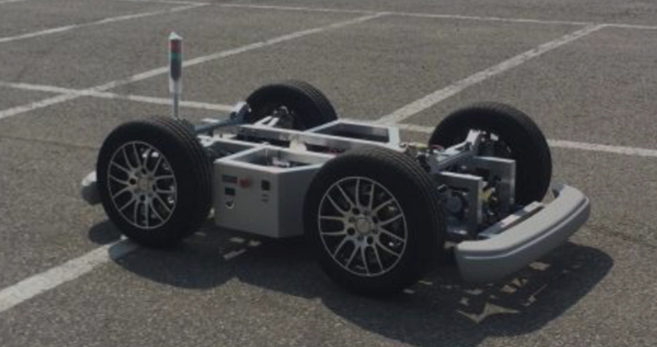
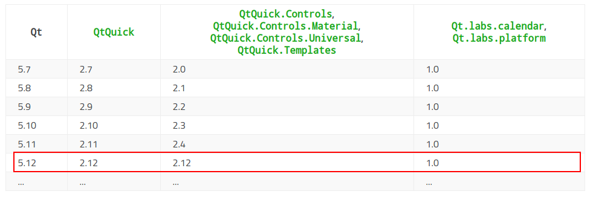

# ERP42-Control-GUI
**[ERP42](http://www.unmansol.com/sub07_en.html#none) Control GUI** for **CAN communication** with **QT/QML** 

>  ERP42 stands for Education Robot Platform and it is the educational platform of vehicle type that the students and researchers can easily test vehicle control, fusion of sensors and self-driving algorithm by replacing real vehicle platform as it have the similar driving, steering and break system to the real one

<left></left>

## Dependency

- Ubuntu 18.04

- [QT 5.12.9](https://doc.qt.io/qt-5.12/qtquickcontrols-index.html)

  

- [PCAN-Driver for Linux](https://github.com/jdj2261/ubuntu-first-install/blob/master/ubuntu-16.04/PEAK%20CAN%20USB%20%EC%84%A4%EC%B9%98.md)

  

## Usage

~~~shell
$ cd ERP_Control
$ mkdir build && cd build
$ qmake ..
$ make 
$ ./ERPControl
~~~

